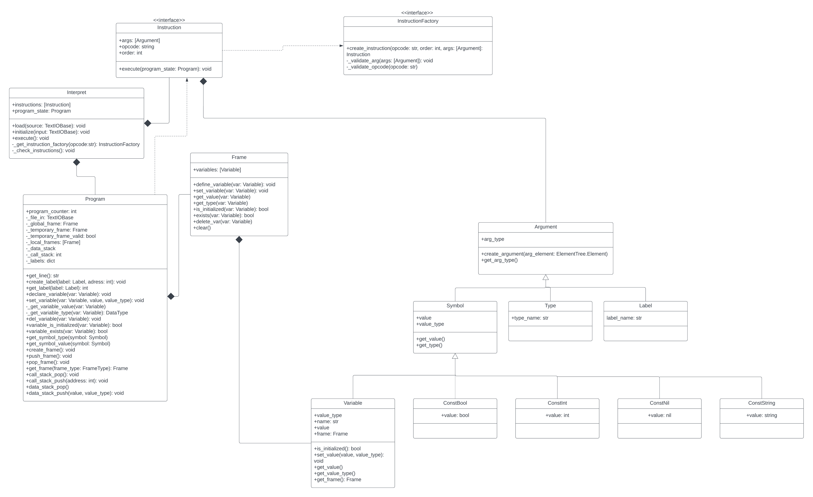

Documentation of Project Implementation for IPP 2022/2023
Name and surname: Samuel Stolarik
Login: xstola03

## Project overview
This is an interpreter for IPPcode23, designed with simplicity and extensibility in mind. The interpreter takes source code and input file as arguments and processes the code according to the language syntax and semantics.

## Usage
Usage:
>python3.10 interpreter.py [--source SOURCE_FILE | --input INPUT_FILE]

This interpreter requires at least one of the following arguments:

`--source SOURCE_FILE`
Specify the IPPcode23 source file.
If not provided, the source code will be read from standard input.

`--input INPUT_FILE`
Specify the input file for the interpreted program.
If not provided, the input data will be read from standard input.

*At least one of the arguments (--source or --input) must be specified.*

## Code organization
The code is organized as follows.
File `interpret.py` is the main file for the whole interpreter. All necessary classes and methods, used by the main script are defined in `ipp23` module.

## Design and design patterns
### General idea
The general idea of our design is implementing the interpreter as a singleton class which, firstly, loads the instructions from XML source code representation into a list, which is then sorted according to instruction's "order" attribute.
With the instructions, the interpreter also holds current program state in an object of Program class. Program object stores all the necessary information to maintain the current state of the program execution. Such as `program_counter` which is an index to the list of instructions, `variable frames` which maintain the state of the variables, and `data stack`.
Each instruction, implements `Instruction` interface, which has `execute` method taking `program_state: Program` as a parameter. Each instruction, during its execution uses and/or changes the `program_state` object to reflect what it does, e.g. the `Jump` instruction will set the `program counter` to the index where `label` instruction is located.
### Design patterns
The interpreter project uses two main design patterns:
#### 1. Factory method
This design pattern is used for creating instructions. An Instruction Factory is responsible for creating different types of instructions.
Using this design pattern allow for separation of the instruction creation process (with adequate syntax checking) from the instruction execution logic.
Also, this design pattern allows for extension of the instruction set quite easily, without having to modify existing classes, obeying the **Open-Closed principle**.
#### 2. Singleton
Even though python does not explicitly support singleton classes, the Interpret class is used as if it was, meaning that there is only one instance of this class throughout the program's execution.
This instance holds all instruction in a list and maintains the current state of the interpreted program in an object of the Program class.

By employing these design patterns, we believe to have achieved a modular and extensible structure of the interpreter's architecture.

### Class diagram
 *(Picture can be found in the docs directory)*  
*To maintain simplicity of the diagram, we do not show instruction and instruction factory class for every instruction. However, these interfaces are implemented for each instruction in `IPPcode23`.*

